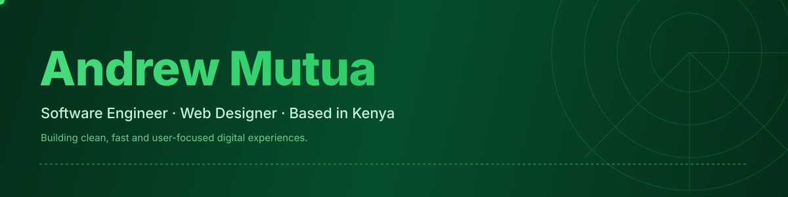

 

 

## 👋 Who I Am

I'm **Andrew Mutua**, a **Software Engineer** and **Web Designer** based in Kenya. I build fast, accessible and visually clean web applications — from the first line of code to the final pixel.

I focus on crafting products that feel effortless: thoughtful interfaces, solid architecture, and performance that respects the user.

- 🎯 **Focus:** Frontend engineering & full-stack web development
- 🎨 **Also good at:** UI/UX design, responsive layouts, design systems
- 🎓 **Currently studying at:** Technical University of Mombasa
- 🌍 **Location:** Kenya
- 💬 **Ask me about:** React, TypeScript, Tailwind, Laravel, Node.js
- 📧 **Email:** developer.mutu@gmail.com

## 🛠️ Tech Stack

**Frontend**

**Backend**

**Tools**

## 🎯 What I'm Working On

- 🔭 Building full-stack web applications with **React + Laravel**
- 🌱 Deepening my knowledge of **TypeScript, system design, and DevOps**
- 🎨 Designing clean, responsive UIs with a focus on user experience
- 🚀 Open to freelance and collaboration opportunities

## 🤝 Let's Connect

I'm always open to interesting projects, collaborations, and conversations about building great software.

 

 

  

Designed & built by <b>Andrew Mutua</b> — Kenya 🇰🇪

